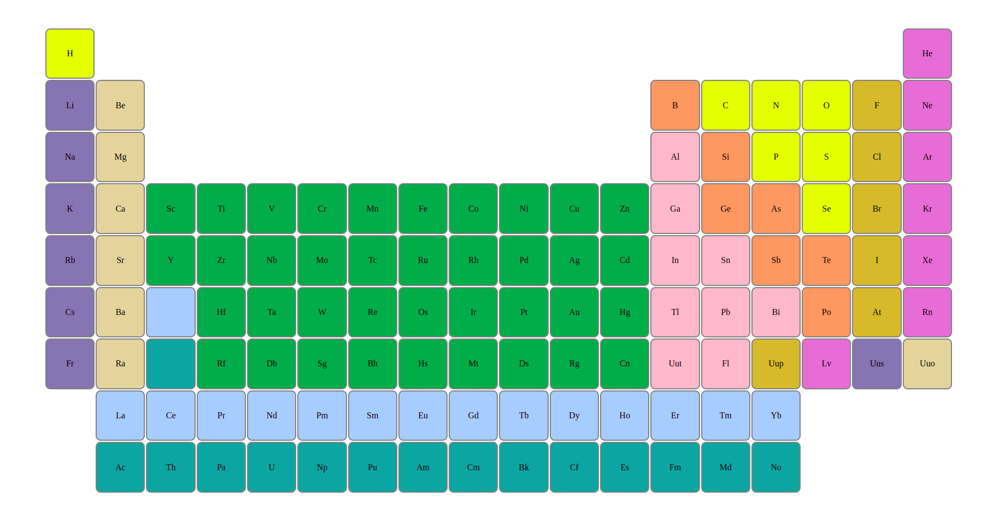

#Periodic Table of the Elements

**[Test this app yourself](https://vincenzoarena.github.io/elements/)**

---

---

### About Project

Exercising with HTML and CSS, I want now to build a Periodic table of the Elements and to try to make my High School Chemistry teacher will be proud...

### How to use this Project

By hovering over the coloured box with one of the Elements, this box will zoom out and its background will become semi-transparent. 

##### Developed With

- [x] _HTML5_
- [x] _CSS3_
- [ ] _SASS_
- [ ] _SCSS_
- [ ] _JavaScript_
- [ ] _React_
- [ ] _Bootstrap_
- [ ] _npm_
- [x] _Markdown_

Training to use flexbox and the pseudo-class :nth-child()

---

### Contact

Mail: <penninoematita@gmail.com> 
GitHub: [vincenzoarena](https://github.com/vincenzoarena) 
LinkedIn: [Vincenzo Arena](https://www.linkedin.com/in/vincenzo-arena-032a064b/)

---

### Used Tools

- [Visual Studio Code](https://code.visualstudio.com/)

---